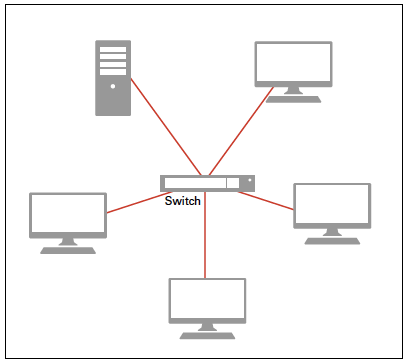
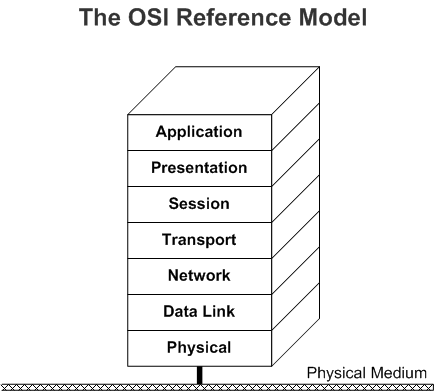
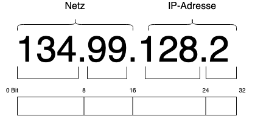
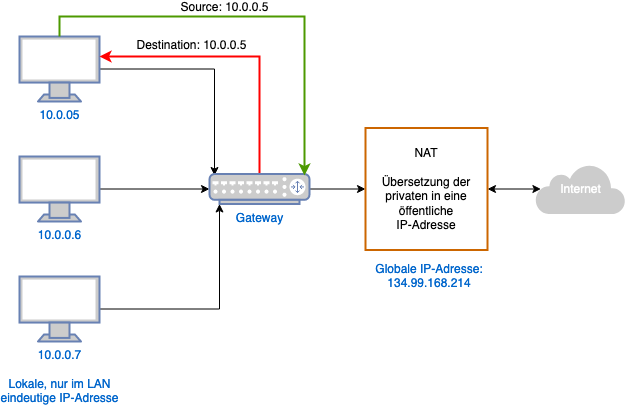
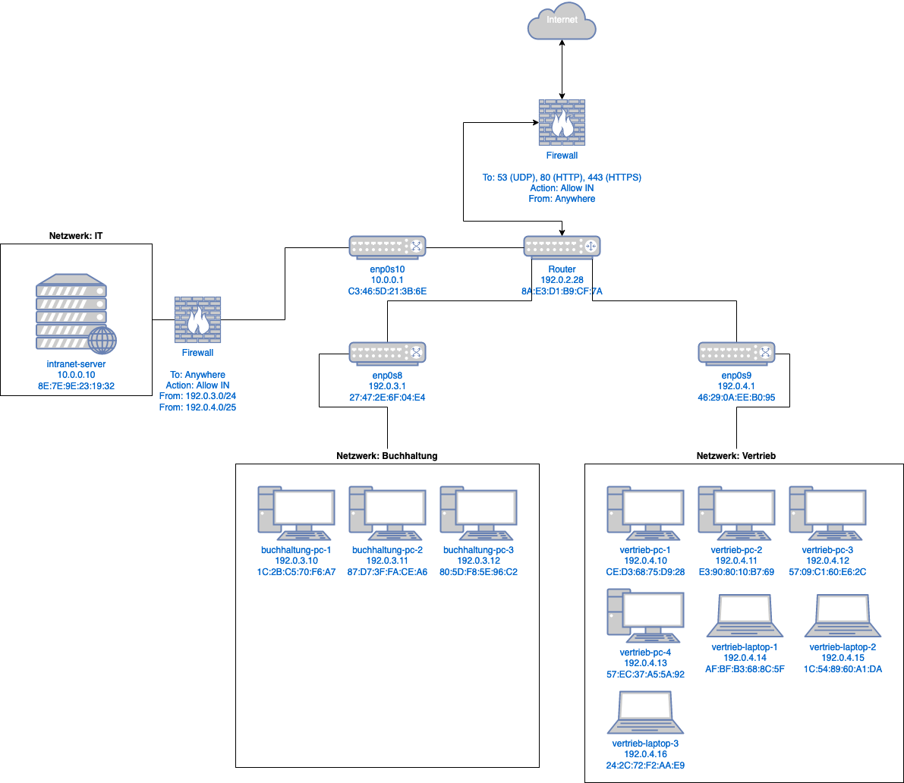

<h1>Inhaltsverzeichnis</h1>
{{TOC}}

# 1 Einleitung

Im Rahmen eines Masterseminars im Studiengang der Informationswissenschaft und Sprachtechnologie an der Heinrich-Heine-Universität Düsseldorf wurden die theoretischen und praktischen Grundlagen zur Erstellung moderner Rechnernetze besprochen. Diese Seminararbeit dient als praktische Anwendung des gelernten Wissens. Dabei wurden alle nicht zitierten Inhalte aus den Kursnotizen entnommen.

In der heutigen Zeit kann behauptet werden, dass fast alle elektronischen Dienste und Programme, die im Alltag verwendet werden, Zugang zum sogenannten Internet besitzen. Angefangen als Vernetzung mehrerer Universitäten namens Arpanet in den 1960er Jahren (Braun, 2019, S. 15), wurde dieses Netzwerk mithilfe des Erfinders Tim Berners-Lee zum heute bekannten World Wide Web (WWW). In einem Interview mit dem Wired Magazine sagte Berners-Lee, das Internet sei seiner Meinung nach längst nicht fertig (Wired, 1999). Fast 21 Jahre nach diesem Interview wächst das einst kleine Rechnernetz immer noch, wobei es gefühlt täglich neue Anwendungen und AnwenderInnen findet. Clement (2019) zeigt in einer Statistik, dass es 2017 ungefähr 3,9 Milliarden Internetnutzer gab, die auf dem gesamten Planeten verteilt verschiedenste Anfragen stellten. Dabei werden diese Anfragen nicht allein von Computern gestellt, die an einem festen Platz aufgebaut sind. Seit Erfindung des Smartphones und der Einführung des Web 2.0, vernetzen sich auch Telefone, TV-Geräte oder smarte Uhren mit dem Internet.

Um diese weltweite Vernetzung nachzuvollziehen, werden die folgenden Kapitel auf die Grundlagen der Netzwerktechnologie und praktische Anwendung anhand eines Beispielunternehmens eingehen. Schlussendlich wird mithilfe des implementierten Beispiels eine Netzwerkarchitektur vorgezeigt und beschrieben. Dieses Ergebnis dient darauf als Ausgangspunkt für eine abschließende Diskussion der umgesetzten Theorien und Ansätze.

+++
# 2 Grundlagen: Rechnernetze in der Theorie

Aufgrund der Tatsache, dass das Internet bereits seit einiger Zeit öffentlich verwendet wird, haben sich die Ansätze zur Erstellung eines Rechnernetzes des Öfteren geändert. Das folgende Kapitel beschreibt die standarisierten Elemente, Vorgehensweisen und dient als Grundlage des darauffolgenden praktischen Methodenteils. 

## 2.1 Die verschiedenen Komponenten

Ein Rechnernetz kann in seiner Größe und Komplexität stark variieren. Laut Braun gilt jedoch eine Definition:
> „Für den Aufbau und Betrieb eines Computernetzes sind mindestens zwei Endgeräte mit mindestens einem *Netzwerkdienst* (Service) zur Kommunikation oder gemeinsamen Ressourcennutzung, ein *Übertragungsmedium* zum Datenaustausch und *Netzwerkprotokolle* nötig.“ (Baun, 2019, S. 17)

### 2.1.1 Endgeräte (Hosts)

Die über das Netzwerk verbundenen Endgeräte stellen typischerweise Computer oder mobile Geräte dar, die in der Netzwerktechnologie als Hosts oder Clients benannt werden. Dementsprechend besitzt ein Netzwerk, in dem vier Computer miteinander verbunden sind, insgesamt vier Hosts.

### 2.1.2 Netzwerkdienst (Service)

Die Kommunikation der verbundenen Geräte kann entweder direkt von Endgerät zu Endgerät ablaufen oder über einen Router, der die angefragten und versendeten Datenpakete in einer Art Postbotenfunktion den verschiedenen Geräten zuweist. Im Falle eines Routers verbinden sich alle Hosts mit einem Gerät welches die gesamte Netzwerkverwaltung, -überwachung und -konfiguration übernimmt. 

+++
### 2.1.3 Stern-Topologie

Dabei werden die Geräte in modernen Rechnernetzen in einer Art Sternform mit dem Router oder einem sogenannten Switch verbunden (Bühler, Schlaich & Sinner, 2018, S. 69). Der Switch wird eingesetzt, um die Menge an Kabelanschlüssen am Router zu erweitern. 

<center>

</center>
<center>Abbildung 1: Stern-Topologie</center>
<center>Quelle: Bühler, Schlaich & Sinner, 2018, S.69</center>

Gegenüber den Vorgängern Bus-Topologie und Ring-Topologie, bietet die moderne Vorgehensweise mehrere Vorteile. Einerseits können beliebig viele Switches in das vorhandene Netzwerk eingebunden werden, um eine Netzwerkerweiterung zu gewährleisten, andererseits können Hosts auch mittels der Wireless Area Local Network (WLAN) Technologie kabellos verbunden werden. Nichtsdestotrotz besteht anfangs ein hoher Verkabelungsaufwand, damit alle Hosts mit den Switches verbunden sind. Des Weiteren verlieren alle Hosts die Verbindung, sollte der zugewiesene Switch ausfallen (Bühler, Schlaich & Sinner, 2018, S.69 ff.).

+++
### 2.1.4 ISO-Schichten

Theoretisch sind die Geräte mittels der bereits angesprochenen Ansätze mit dem Netzwerk verbunden. Praktisch muss diese Verbindung jedoch weiter ausgeführt und definiert werden. Was nämlich grundlegend fehlt, ist die Funktionalität der Kommunikation. Es kann gesagt werden, dass die Netzwerkkommunikation mithilfe versendeter und empfangener Nachrichten von Statten geht. Ein Computer fragt etwas mittels Nachricht an und erhält bestenfalls ein Antwort.

Die Nachrichten werden Protokolle genannt, die auf verschiedenen Schichten unterschiedliche Aufgaben absolvieren (Baun, 2019, S. 35). Die Schichten werden vereint und bilden das sogenannte ISO-Modell, wobei die Abkürzung für die International Organisation of Standarization steht. Manchmal wird das Modell auch OSI genannt, wobei dies wiederum für Open System Interconnection steht. 

#### 2.1.4.1 Die Schichten

Insgesamt besteht das Modell (siehe Abbildung 2) aus sieben Schichten, die abhängig der aktuellen Aufgabe von unten oder oben durchlaufen werden. Sendet ein Host eine Nachricht, startet der Verkehr in der physikalischen Schicht (Physical Layer). Empfängt der Host eine Antwort, wird diese über die Anwendungsschicht an die weiteren Ebenen vermittelt (Microsoft, 2020).

<center>

</center>
<center>Abbildung 2: The OSI Reference Model</center>
<center>Quelle: Microsoft, 2020</center>

**Physical Layer:**\
Diese Schicht beschäftigt sich mit der Übertragung der Informationen zwischen den einzelnen physikalischen Komponenten des Netzwerkes, die direkt miteinander verbunden sind (Baun, 2019, S. 45). Die einzelnen Geräte können dabei auf zwei verschiedenen Wegen miteinander verbunden sein: Ethernet, Wireless Local Area Network (WLAN). Das Ethernet (IEEE 802.3) stellt dabei die am häufigsten verwendete Verbindungsmöglichkeit dar. Die in den 1970er Jahren vorgestellte Technologie verbindet die Geräte mithilfe spezieller Kabel und bildet somit ein Local Area Network (LAN) (Baun, 2019, S, 45). Zweiteres beschäftigt sich mit einem komplett kabellosen Ansatz und bildet ein WLAN. Die Geräte sind per Funkverbindung in das Netzwerk eingebunden. Hierbei müssen jedoch physikalische Naturgegebenheiten beachtet werden, die das Funksignal negativ beeinflussen könnten.

**Data Link Layer:**\
Bei der erwähnten Informationsübertragung kann es in der Praxis des Öfteren zu unvermeidbaren Fehlern kommen, die abgefangen werden müssen. Die im Deutschen auch Sicherungsschicht genannte Komponente des ISO Modells wird für die Fehlerbehebung und -überwachung eingesetzt. Grundlegend wird jede Nachricht in einen Sicherheitsrahmen (Frame) verpackt, und vom Empfänger wieder entpackt. Um die Nachricht zu diesem Zeitpunkt an den richtigen Empfänger senden zu können, werden die jeweiligen Media Access Control (MAC) Adressen mitgesendet. Die Sicherung wird gegeben, indem jedem Paket eine Prüfnummer zugeteilt wird, die letztendlich verglichen wird (Baun, 2019, S. 38; Microsoft, 2020).

**Network Layer:**\
Sind die Informationen physisch vorhanden und abgesichert worden, besteht die Aufgabe der Vermittlungsschicht (Network Layer) darin, die letztendliche Versendung der Pakete im logischen Netz über die physische Schnittstelle (LAN, WLAN) hinweg zu absolvieren (Baun, 2019, S. 39; Microsoft, 2020).
>  „Beim Sender verpackt die Vermittlungsschicht die Segmente der Transportschicht in Pakete. Beim Empfänger erkennt und entpackt die Vermittlungsschicht die Pakete in den Rahmen der Sicherungsschicht.“ (Baun, 2019, S. 39)

**Transport Layer:**\
Die Aufgabe der Transportschicht besteht in der fehlerfreien und verlustfreien Übertragung der Nachrichten (Microsoft, 2020).

**Application Layer:**\
Die Schichten Präsentation und Session werden generell in die Application- und Transportschicht mit eingebunden und müssen an dieser Stelle nicht einzeln erläutert werden.\
&nbsp;&nbsp;&nbsp;&nbsp;&nbsp;&nbsp; Die Anwendungsschicht (Application Layer) beinhaltet alle finalen Protokolle, die an das Empfangsziel versendet werden sollen. Diese Protokolle können beispielsweise an einen Webserver verschickt werden, um als Ergebnis eine Webseite zu erhalten, die auf dem Endgerät des Nutzers angezeigt werden kann. 

## 2.2 IP-Adressen

In der Vermittlungsschicht wurde ein entscheidendes Protokoll ausgelassen: Das Internet Protokoll (IP). Dieses Protokoll wird für das verbindungslose Senden und Empfangen von Paketen verwendet (Baun, 2019, S. 39). 

Jeder Host in einem Netzwerk erhält eine eindeutige Adresse, die für eine unbestimmte Zeit bestehen bleibt. Anhand dieser 32 Bit langen IP-Adresse ist das Gerät eindeutig ansprechbar. Der Unterschied zu einer MAC-Adresse ist folgender: Die MAC-Adresse referiert ein eindeutiges physikalisches Gerät, beispielsweise einen Computer der Marke Lenovo. Diese Adresse bleibt für das eine Gerät immer gleich. Die IP-Adresse hingegen referiert ein eindeutiges Gerät (Host) im Netzwerk.

Es gibt zwei verschiedene IP-Adressversionen: IPv4 und IPv6, wobei Erstere die meistverbreitete ist. Eine IPv4 Adresse besteht aus vier Acht-Bit-Paaren: **XXX.XXX.XXX.XXX**. Eine Beispieladresse kann dabei wie folgt aussehen: **192.0.2.200**. Wie die Adresse aber letztendlich aussieht, hängt grundlegend von zwei Faktoren ab: 

- Verwendete IP-Adressklasse
- Statische oder dynamische IP-Adresse

Adress-Beispiel:

<center>

</center>
<center>Abbildung 3: IPv4 Beispiel</center>

### 2.2.1 IP-Adressklassen

Es kann zwischen drei Adressklassen ausgewählt werden: A, B und C. Sie unterscheiden sich in der Anzahl möglicher Subnetze und Hosts. Die beiden Parameter sind dabei voneinander abhängig — je mehr Subnetze möglich sind, desto weniger Hosts können verwendet werden.

- **Klasse A:**
	- 128 Subnetze
	- 16.777.214 Hosts
		- 2^24-2 Möglichkeiten
	- Die Adresse fängt immer mit der **0** an, wobei die restlichen Bit für die **Host-ID** verwendet werden.
		- 8 Bit Netz-ID
		- 24 Bit für Host-ID
- **Klasse B:**
	- 16.384 Subnetze
	- 65.534 Hosts
		- 2^16-2
	- Fängt mit **1.0** an
	- 16 Bit Netz-ID
	- 16 Bit Host-ID
- **Klasse C:**
	- 2.097.152 Subnetze
	- 254 Hosts
		- 2^8-2
	- Weniger mögliche Computer in einem Netz (254), jedoch können viele Subnetze verwendet werden, damit jeweils bis zu 254 Rechner voneinander getrennt im Gesamtnetz angebunden sind.
	- 26 Bit für die Netz-ID 
	- 8 Bit Host-ID

### 2.2.2 Netzadresse / Broadcastadresse
In jedem IP-Adressbereich sind zwei Adressen reserviert. Darum wird auch immer mit 2^n-2 gerechnet.

#### 2.2.2.1 Netzadresse

Sie adressiert das Netzwerk selbst, wobei alle Host-Adressen-Bits den Wert *‌ø* besitzen.

Beispiele:
- 192.168.13.ø
	- Klasse C Netzwerk
- 11.0.0.0
	- Klasse A Netzwerk

+++
#### 2.2.2.2 Broadcastadresse

Pakete mit dieser Adresse gehen an jeden Rechner im Netz. Alle Host-Adressen-Bits haben den Wert 1

Beispiele:

- 192.168.13.255
	- Klasse C Netzwerk)
- 11.255.255.255
	- Klasse A Netzwerk

### 2.2.3 Privatadressen
Da nicht jede Adresse im öffentlichen Internet verfügbar sein soll, gibt es für jede Adressklasse fest definierte Bereiche, die für private IP-Adressen verwendet werden. Aus dem hauseigenen WLAN sind Adressen, wie 192.168.2.25 vielleicht bereits bekannt:

- **Class A:**
	- 10.0.0.0 bis 10.255.255.255
- **Class B:**
	- 172.16.0.0 bis 172.31.255.255
- **Class C:**
	- 192.168.0.0 bis 192.168.255.255

### 2.2.4 Classless Inter Domain Routing (CIDR)
Im Rahmen dieser Definitionen wurde festgestellt, dass die Klassenbasierten Netze zu unflexibel sind, da nur drei Größen (A,B,C) zur Verfügung stehen. Dies ist jedoch sehr verschwenderisch im Umgang mit dem Adressraum, der mit 32 Bit zur Verfügung steht. Werden beispielsweise 300 Hosts in einem Klasse B Netz eingebunden, bleiben 65.234 mögliche Hosts ungenutzt. Dementsprechend werden diese im Adressraum für andere blockiert. Klasse A Netze sind eher nicht sinnvoll zu administrieren, da Broadcast-Nachrichten an bis zu 16 Millionen Rechner gesendet werden könnten. So besteht auch keine logische Trennung von Netzbereichen. Jeder Computer, der einen Broadcast sendet, sendet eine Nachricht an alle.

#### 2.2.4.1 Lösung
Zur Lösung des Problems können Subnetze zur Hand genommen werden. Das große Gesamtnetz wird in mehrere kleine Netze unterteilen:

- Subnetting:
	- Die Aufteilung eines Netzes in mehrere kleine Netze
- Supernetting:
	- Die Zusammenfassung mehrerer kleiner Netze zu einem großen Netz

Dies benötigt den Begriff der Netzwerkmaske (eng. Netmask). Diese Maske ist genau so lang wie die IP-Adresse (32 Bit). Sie spiegelt alle Rechner in einem bestimmten Netz oder Subnetz wider.

#### 2.2.4.2 Netzwerkmaske
Die Netzwerkmaske hat dabei die gleiche Größe wie eine IP-Adresse. des Weiteren gibt sie an, wo die Grenze zwischen Netzwerkanteil und Host-Anteil einer IP-Adresse verläuft. Durch diese Angabe weiss der Administrator sofort wo das Netz ist:

- Alle Netz-Bits auf **1**
- Alle Host-Bits auf **0**

**Default Netzwerkadressen:**

- **Klasse A:**
	- 255.0.0.0
- **Klasse B:**
	- 255.255.0.0
- **Klasse C:**
	- 255.255.255.0

#### 2.2.4.3 Subnetting
Mit der Netzwerkmaske kann kontrolliert werden, wie viele Netze und Hosts verwendet werden sollen. Durch die Erweiterung der Netzwerkmaske durch Bits des Host-Anteils wird das Netz in mehrere Subnetze aufgetrennt. Man ersetzt eine der acht Einsen des Bytes in eine Null (RFC 950). 
- 1111.1111 -> 1111.1110 

Beispiel:
- 192.168.13.0 / 255.266.255.128

Dies teilt das Klasse C Netz in zwei Netze, da die Netzwerkmaske um einen Bit aus dem Host-Anteil erweitert ist. Da der Host-Anteil der Adresse verringert wird, kann jedes Subnetz nur noch knapp die Hälfte des ursprünglichen Hosts fassen: 126

Eine verbreitete Schreibweise wäre dabei die folgende:

**Netz 1:** 192.168.13.0 / 255.255.255.128
- Netzadresse: 192.168.13.ø
- Broadcastadresse: 192.168.13.127

**Netz 2:** 192.168.13.128 / 255.255.255.128
- Netzadresse: 192.168.13.128
- Broadcastadresse: 192.168.13.255

### 2.2.5 CIDRE Netzschreibweise
Die IP-Adresse wird immer inklusive Netzmaske niedergeschrieben. Die Idee dahinter ist: Wenn immer alle Netz-Bits auf Eins und alle Host-Bits auf ø stehen müssen, reicht die Notierung der Anzahl der Netz-Bits.

Beispiel: 

- Subnetz in C-Größe aus einem Klasse B Netz:
	- Langform: 172.16.12.0 / 255.255.255.ø
	- Kurzform: 172.16.12.0/24

Ein Subnetz á 126 Hosts und zwei Subnetzen á 62 Hosts aus Klasse C Netz:
- Langform: 
	- 192.168.71.ø / 255.255.255.128
	- 192.168.72.128 / 255.255.255.192
	- 192.168.72.192 / 255.255.255.192
- Kurzform: 
	- 192.168.72.ø/25
	- 192.168.72.128/26
	- 192.168.72.192/26 

Es wird somit der Adressraum von 192 bis 255 für die 62 Host-Computer reserviert. So sind zwei Subnetze mit á 62 freien Hosts für Rechner vorhanden.

## 2.3 Network Address Translation (NAT)

Das Problem beim Classless Inter Domain Routing ist jedoch, dass Adressen auch beim Einsatz dieses Konzeptes global eindeutig sein müssen. Fragt ein bestimmter Computer des Netzwerkes einen Webserver an, muss der außenstehende Webserver eindeutige Informationen über den Sender der Nachricht erhalten. Die Idee hinter der Network Address Translation ist folgende: 

In einem Firmennetz brauchen nur die Rechner eine globale eindeutige Adresse, die aktuell Verbindungen aus dem Firmennetz heraus aufbauen. Ein Gateway, meist der Router, vergibt den Anfragestellern eine eindeutige Adresse aus einem Adresspool (Bühler, Schlaich & Sinner, 2018, S. 89 ff.).


### 2.3.1 Multiplexing
Alle Rechner werden durch das NAT an das öffentliche Internet weitergeleitet. Das NAT vergibt somit eine öffentliche IP für die Rechner, die aktuell eine Anfrage an das Internet stellen möchten (siehe Abbildung 4):


<center>Abbildung 4: Network Address Translation - Multiplexing Beispiel</center>
<center>Quelle: Abgewandelt von Kursmitschriften, 18.02.2020</center>


## 2.4 Domain Host Control Protocol (DHCP)

Sollen die bereits theoretisch besprochenen IP-Adressen nicht für jeden Host manuell angegeben werden, bietet ein sogenannter DHCP-Server eine hilfreiche Lösung an. Die Idee ist dabei folgende: 

Die IP Adresse eines Gerätes wird automatisch von einem DHCP-Server zugewiesen, sodass nur eine öffentliche IP-Adresse verteilt wird, sobald der Zugang zum Internet benötigt wird. Nach einer festgelegten Zeit werden die IP-Adressen vom DHCP-Server neu verteilt. So kann auch in einem Unternehmen mit 100 PCs aber nur 80 freien IP-Hosts allen der Zugang zum Internet ermöglicht werden, da wahrscheinlich nie alle 100 gleichzeitig im Internet sein werden.

## 2.5 Interne Datenübertragung

Hat jeder Host im Netzwerk eine eindeutige, private IP-Adresse erhalten, soll gegebenenfalls die interne Kommunikation ermöglicht werden. Dafür können zwei Protokolle verwendet werden: UDP oder TCP.

### 2.5.1 User Datagram Protocol (UDP)

Beim User Datagram Protocol wird eine Verbindung ohne jegliche Sicherung aufgebaut, wobei Übertragungen nicht erst seitens des Empfängers bestätigt werden müssen. Ist ein Paket fehlerhaft und überliefert nicht alle Informationen, wird es trotzdem verwendet (Baun, 2019, S. 174). Gerade bei Echtzeitübertragungen (Videotelefonie) stellt der Verlust kleinerer Datenmengen kein Problem dar (Trick & Weber, 2015). 

### 2.5.2 Transmission Control Protocol (TCP)

Beim Transmission Control Protocol dagegen würden Verluste in der Datenübertragung immer zu einer erneuten Anfrage führen, wodurch es gerade beim Streaming-Vorgang zu Aussetzern kommen könnte. Dafür wird jedoch jedes Datenpaket auf die Sicherung überprüft und erst nach erfolgreicher Validierung weiterverwendet (Baun, 2019, S. 175 ff.). 
 
 +++
## 2.6 Domain Name System (DNS)

Neben der internen Datenübertragung wird in den meisten Rechnernetzen auch der Zugriff auf verschiedene Hosts mithilfe eindeutiger und für Laien leserlicher Namen gewährleistet. Diese Namen werden in der Netzwerktechnologie Domain-Namen oder nur Domain genannt. 

### 2.6.1 Allgemein

Eine Domain ist dabei in mehrere Komponenten aufgeteilt:

- Host
	- www.
- Subdomain
	- phil.
- Domain
	- hhu.
- Land / Organisation
	- .de

Aus diesem Beispiel wird die folgende Domain gebildet:\
**www.phil.hhu.de**

Die Endung *.de* wird meistens als Länderkennung verwendet. So kann aus der oben gelisteten Domain schlussgefolgert werden, dass sich die Entität **hhu** in Deutschland befindet. Neben den Länderkennungen gibt es aber noch andere Varianten (Top Domain Level (TDL)):
- .app 
	- Mobile Apps
- .farm
	- Landwirtschaft
- .info
	- Informationen
- .io
	- International Organisation
- .singles
	- Online-Dating
- .berlin
	- Für die Stadt Berlin
- …

Somit befasst sich ein DNS-Server mit der Zuordnung von IP-Adressen zu Rechnernamen. Ursprünglich wurden alle Rechnernamen in der Datei `/etc/hosts` eingetragen. Diese Vorgehensweise erfordert jedoch einen zu hohen Verwaltungsaufwand in großen Netzen. Es kommt zu Konsistenzproblemen. Ab Mitte der 1980er Jahre wurde eine verteilte Datenbank DNS (RFC 1034, RFC 1035) eingeführt. Es wurden Namensbereiche (Domains) in hierarchischer Baumstruktur organisiert. Die Delegation von Subdomains an Organisationen mit separater Autorität (Zonenprinzip) wurde definiert, sodass es zu einer Client-Server-Architektur (Resolve-Nameserver) kam, die über Port 53/UDP kommuniziert.

Sogenannte Nameserver wurden für Subdomains an andere Organisationen vergeben. Nameserver sind hierbei für die Verwaltung von Informationen über einen Teil des Domain-Raums (Zone) zuständig. Sie sind außerdem für eine oder mehrere **Zonen** verantwortlich. Die Zone-Dateien enthalten wiederum Informationen (Resource Records (RR)) über alle Hosts der Zonen und Verweise auf Nameserver.

### 2.6.2 Arten von Nameservern

Da ein definierter Nameserver aus einem unbestimmten Grund ausfallen könnte, sollten immer mehrere angegeben werden. Damit diese Nameserver fehlerfrei zusammenarbeiten, gibt es verschiedene Arten von Nameservern: Primary, Secondary, Caching-Only.

#### 2.6.2.1 Primary (Primärer Nameserver)
Diese Variante verwaltet die lokale Zonen-Datei. Gegebenenfalls wird ein untergeordneter Nameserver namens Slave (Secondary) über Änderungen der Zone-Datei benachrichtigt (Notify).

#### 2.6.2.2 Secondary, Slave (Sekundärer Namesserver)
Wurde der Primary Nameserver definiert, ist es die Aufgabe des Secondary Nameservers die erstellte Zonen-Datei zu kopieren:

Die Zonen-Dateien des primären Nameservers (Master) werden bei Bedarf oder einer Benachrichtigung (Notify) in lokale Sicherungsdatei (Zonentransfer) gespeichert.

Dieser Vorgang sorgt für Redundanzen, Lastenverteilung und Ausfallsicherheit. Schlussendlich besitzt der Slave genau wie der primäre Master Autorität über die transferierte Zone.

#### 2.6.2.3 Caching-Only Nameserver
Die dritte Variante dient des Cachings der Daten. Weil  der Caching-Only Nameserver keine Zone hat, fehlt im auch die Autorität jeglicher Zonen. Somit kann er lediglich für das Caching verwendet werden. 

Er leitet Anfragen weiter (Forwarding) und „cached“ wie alle Nameserver die Abfrageergebnisse. Dabei ergibt sich eine Lastenverteilung.


### 2.6.3 Namensauflösung: Vorgehensweise

Die Aufgabe des DNS ist dementsprechend die Auflösung einer IP-Adresse in einen Namen. Dieser Vorgang wird folgendermaßen ausgeführt:

1. Der angeforderte Name liegt in der Zone, für die der Nameserver autorisiert ist. Die Antwort wird sofort ausgeliefert.
2. Der angeforderte Name liegt im **Cache** des Nameservers. Der (nicht autoritative) Inhalt des Cache wird mit entsprechendem Hinweis ausgeliefert. Veraltete Informationen werden aus dem Cache gelöscht. Dazu dient eine definierte Zeit, in der die Informationen „leben“ (TTL = Time to live).
3. Sollte der angeforderte Name nicht aus dem Datenbestand des Nameservers ermittelt werden, kommt es zu einer Anfrage. Die fehlenden Informationen werden von anderen Nameservern ermittelt.


### 2.6.4 Lookup & Reverse Lookup

Die Domain kann nicht lediglich für das einfache Erreichen eines Hosts verwendet werden, sondern auch zur Abfrage der Information über einen bestimmten Host. Beim Lookup kann somit gefragt werden, wie ein Rechner mit der Domain *hhu.de* heisst. Andersherum kann auch die Domain der IP-Adresse *134.99.128.238* abgefragt werden. Um diese Auskünfte zu erhalten, können verschiedene Befehle in der Kommandozeile verwendet werden: 

- `$ host hhu.de`

Dieser Befehl gibt die IP-Adresse des Webservers wieder, auf dem die Webseite der abgefragten Domain betrieben wird.


## 2.7 Firewall

Eine Firewall ist eine Komponente zum Schutz eines (internen) Netzes bzw. einer Komponente gegen Angriffe von außen. Sie analysiert eingehende und ausgehenden Datenpakete und blockiert sie gemäß vorher definierter Regeln. Dies geschieht entweder auf IP-Adressebene, Portebene oder in der Anwendungsschicht des ISO-Modells.

###  2.7.1 Bastion Hosts als Firewall
Eine Firewall-Variante ist die Bastion Hosts. Dabei existiert ein Rechner mit (mindestens) zwei Netzwerkkarten = Bastion Host. Dieser sorgt für die Paketfilterung. Dabei besteht ein Angebot von Diensten zum Zugriff von außen (z.B. Webserver). Andere Rechner des lokalen Netzes sind abgesichert und nach außen unsichtbar.


+++
# 3 Methoden: Erstellung eines Unternehmensnetzwerkes

Nachdem die theoretischen Grundlagen moderner Rechnernetze besprochen wurden, kann für ein Beispielunternehmen ein internes Netzwerk aufgesetzt werden.\
&nbsp;&nbsp;&nbsp;&nbsp;&nbsp;&nbsp; Das folgende Kapitel wird sich dementsprechend mit der Installation aller nötigen Dienste auf den Endgeräten (Hosts) beschäftigen und das Netzwerk Schritt für Schritt zusammenstellen.

## 3.1 Vorstellung des Unternehmens

Ein junges Startup-Unternehmen entscheidet sich nach Einzug in ein neues Büro für die Installation eines internen Netzwerkes. Die insgesamt zehn MitarbeiterInnen sind aufgeteilt in zwei Abteilungen:

1. Buchhaltung
	- Drei MitarbeiterInnen
2. Vertrieb
	- Sieben MitarbeiterInnen

Aufgrund des Umgangs mit sensiblen Daten in jenen Arbeitsgruppen, sollen sie logisch voneinander getrennt sein. Personen aus dem Vertrieb sollen keine Möglichkeit haben über die Buchhaltung an Gehaltsabrechnungen oder andere Finanzinformationen zu gelangen. Andersherum, soll die Buchhaltung aus den Vertriebsprozessen des Unternehmens ausgeschlossen werden.

Um bestimmte Daten und Inhalte im internen Netz einsehen und teilen zu können, soll ein Intranet-Server aufgesetzt werden. Auf diesem Server wird eine Webseite betrieben, welche verschiedenste Unternehmensdaten beinhaltet. Somit könnten MitarbeiterInnen beispielsweise Geburtstage oder Speisepläne einsehen.

+++
## 3.2 Planung des internen Netzwerkes

Es sollen also zehn MitarbeiterInnen aus zwei Abteilungen in das interne Netzwerk integriert werden. Dabei wird davon ausgegangen, dass die MitarbeiterInnen während der Arbeitszeit im Büro an einem festen Platz tätig sind. Die Geräte können mithilfe eines Kabels integriert werden. Somit wird die Verbindung über ein LAN hergestellt. In Zukunft könnte über die Installation eines WLAN nachgedacht werden, um Gästen den kabellosen Zugang zum Internet zu gewährleisten.

### 3.2.1 Aufteilung in Subnetze
Um die erforderliche Trennung der beiden Abteilungen einzubauen, wird pro Abteilung ein eigenes Subnetz installiert. Der Intranet-Server wird dabei in einem eigenen Netzwerk aufgesetzt, um ihn logisch und physisch abzusetzen. Es ergeben sich die folgenden Kennzahlen:

- Drei interne Subnetze
	- Buchhaltung
		- Anzahl Hosts: 3
		- Art der Hosts: Computer
	- Vertrieb
		- Anzahl Hosts: 7
		- Art der Hosts: Computer
	- IT
		- Anzahl Hosts: 1
		- Art der Hosts: Webserver

### 3.2.2 Auswahl der IP-Adressklassen

Wie bereits im theoretischen Teil dieser Arbeit erwähnt wurde, gibt es für die Verteilung der IP-Adressen die Möglichkeit zwischen drei Klassen auszuwählen (Klasse A, Klasse B, Klasse C). Grundsätzlich muss hinsichtlich dieser Entscheidung prognostiziert werden wie sich das Unternehmen und die damit hergehende Anzahl der MitarbeiterInnen in Zukunft entwickeln wird. Benötigt das Unternehmen lediglich viele Hosts, die im selben Subnetz agieren, stellt Klasse A eine geeignete Lösung dar. Soll sich eine Abteilung in Zukunft jedoch in weitere Subnetze aufteilen, können die Klassen B und C in Betracht gezogen werden. Für das Beispielunternehmen wird davon ausgegangen, dass sich in einem zukünftigen Subnetz nie mehr als 200 MitarbeiterInnen befinden werden. \
&nbsp;&nbsp;&nbsp;&nbsp;&nbsp;&nbsp; Für die Abteilungen Buchhaltung und Vertrieb kann somit Klasse C ausgewählt werden. Bezüglich des IT Subnetzes, wird Klasse A verwendet, da sich alle zukünftigen Server und IT-MitarbeiterInnen im selben Netzwerk befinden sollen. Dies ist sinnvoll, da IT-Angestellte den vollen Zugriff auf die produktiven Server brauchen, um Erweiterungen zu installieren oder Fehler zu beheben.

### 3.2.3 Verteilung der IP-Adressen

Nachdem die IP-Adressklassen ausgewählt sind muss die Verteilung der verfügbaren IP-Adressen der Subnetze geplant werden. Es kann zwischen den bereits erwähnten statischen und dynamischen Adressen gewählt werden. 

**Statische IP-Adressen:**\
In einem kleinen Unternehmen mit vergleichsweise wenigen Endgeräten könnte die Verwendung statischer IP-Adressen in Betracht gezogen werden. So hätte jedes Gerät dauerhaft die selbe Adresse im internen Netzwerk und könnte über diese angesprochen werden. Dies ist gerade bei Servern sinnvoll. Ein Vorteil ist dabei die Ersparnis eines DHCP-Servers, welcher bei der dynamischen Variante installiert werden muss. Dementsprechend wird für den eingesetzten Intranet-Server eine statische IP-Adresse genutzt.

**Dynamische IP-Adressen:**\
Ein Nachteil der statischen IP-Adressen ist jedoch der hohe Wartungsaufwand bei auftretenden Veränderungen im internen Netzwerk. Fällt ein Computer weg oder kommt ein neuer hinzu, müssen die verwendeten Adressen bestenfalls in einem organisierten Verfahren neu verteilt werden, um die Ordnung und Übersicht beizubehalten. Da jedoch davon ausgegangen wird, dass das Beispielunternehmen in Zukunft wachsen wird, sollen für die Hosts der Subnetze Buchhaltung und Vertrieb dynamische Adressen mithilfe eines DHCP-Servers verteilt werden. 

### 3.2.4 Einfacher Zugriff auf Intranet-Server mittels Domain-Namen

Möchte eine MitarbeiterIn auf den Intranet-Server zugreifen, um allgemeine Unternehmensinformationen einzusehen, muss sie laut der aktuellen Planung die statische IP-Adresse mit dem Format `http://ip-adresse` in ihrem Webbrowser eingeben. Das Verständnis für die Verwendung einer IP-Adresse kann bei einer MitarbeiterIn aus der Abteilung Buchhaltung oder Vertrieb aber nicht vorausgesetzt werden. Es soll der Person ermöglicht werden, den Webserver mittels einer für Laien leserlichen Domain zu besuchen. Diese Domain könnte folgendermaßen aussehen: `http://intranet.company.local`.

### 3.2.5 Firewall: Dedizierter Zugriff 

Bis auf die Beachtung der Sicherheit, ist das interne Netzwerk bis hierhin grundlegend geplant worden.

Die Endgeräte sind zwar logisch und physisch voneinander getrennt, es besteht jedoch immer noch die Möglichkeit unerwünschter Zugriffe von Außen. Zum aktuellen Stand sind Angriffe über alle Ports und Protokolle gestattet. Dieses Problem wird durch die Installationen zweier Firewalls gelöst.\
&nbsp;&nbsp;&nbsp;&nbsp;&nbsp;&nbsp; Einerseits sollen Hosts des interneren Unternehmensnetzwerkes nur auf öffentliche Webseiten zugreifen können. Andererseits ist es nur den MitarbeiterInnen des Unternehmens gestattet auf den Intranet-Server zuzugreifen. Mittels dieser beiden Regeln können lediglich HTTP und HTTPS Pakete zwischen dem öffentlichen Internet und den internen Hosts versendet werden. 

#### 3.2.5.1 Physische Trennung der Subnetze

Im Laufe der Planung wurde die physische Trennung der drei Subnetze mehrere Male angesprochen. Diese Lösung ist jedoch nur eine von zwei möglichen Varianten zur Aufteilung eines Netzwerkes. Der Router könnte auch lediglich eine Netzwerkkarte verwenden, um das interne Netzwerk zu verwalten. Aus Sicherheitsgründen ist dies aber nicht zu empfehlen, da das gesamte Unternehmensnetzwerk eingesehen werden könnte, sollte ein Angriff auf diese eine Netzwerkkarte erfolgreich ausgeführt worden sein. Werden die Netzwerke mithilfe physischer Netzwerkkarten voneinander getrennt, muss es dem Angreifer gelingen Zugang zum physischen Gerät des Routers zu erhalten, um auch die anderen Subnetze einzusehen.


+++
## 3.3 Implementierung des Netzwerkes

Ausgehend der vorangegangenen Planung, können die einzelnen Komponenten implementiert werden.

### 3.3.1 Router / Gateway

Der Router, auch Gateway genannt, dient als zentrales Steuerungselement, der das interne Netzwerk mit dem öffentlichen Internet verbindet. Er besitzt insgesamt vier Netzwerkkarten, um drei physisch voneinander getrennte Subnetze zu verwalten. Darüberhinaus befindet sich auf dem Router ein DHCP-Server zur dynamischen Verteilung der IP-Adressen und ein DNS-Server für das einfache Erreichen des Intranet-Servers mittels einer für Laien leserlicher Domain.

#### 3.3.1.1 Netzwerkkarten

Die drei internen Netzwerkkarten werden im Router konfiguriert, wobei folgende Befehle ausgeführt werden, um die Karten für die Bearbeitungszeit herunterzufahren und die geplanten Subnetze zu erzeugen:

- `$ ifdown enp0s3`
- `$ nano /etc/network/interfaces`

Neben den bereits vorhandenen Informationen, werden in dieser Datei drei Definitionen angegeben:

```
# Primäres Netzwerk
allow-hotplug enp0s3
iface enp0s3 inet dhcp

# Buchhaltung Netzwerk
allow-hotplug enp0s8
iface enp0s8 inet static
	address 192.0.3.1/24
	
# Vertrieb Netzwerk
allow-hotplug enp0s9
iface enp0s9 inet static
	address 192.0.4.1/24
	
# IT Netzwerk
allow-hotplug enp0s10
iface enp0s9 inet static
	address 10.0.0.1/8
```

Alle drei Subnetze erhalten eine statische IP-Adresse, um sie eindeutig angeben zu können. Bis auf das IT Netzwerk (Klasse A) wird die IP-Adressklasse C verwendet. Damit die Änderungen in Kraft treten, wird die Netzwerkkarte mittels des Befehls `ifup enp0s3` wieder hochgefahren.

**IP-Forwarding:**\
Generell sind die Computer der drei internen Netzwerke physisch und logisch voneinander getrennt. Es kann jedoch sein, dass zu bestimmten Zwecken Angestellte aus den Abteilungen Buchhaltung und Vertrieb zusammenarbeiten und gemeinsame Dienste verwenden. So ist ein gegenseitiger Zugriff der Netzwerke von Nöten. Später wird in der Firewall wird wie geplant festgelegt, welche Ports und Dienste für diese Zusammenarbeit offen stehen, damit sensible Daten immer noch voneinander getrennt sind.

IPv4 Forwarding auf dem Router freigeben:

- `$ nano /etc/sysctl.conf`

```bash
# Uncomment the next line to enable packet forwarding for IPv4
net.ipv4.ip_forward=1
```


### 3.3.2 DHCP
Damit die IP-Adressen nicht manuell und statisch in jedem einzelnen Host angegeben werden müssen, wird ein DHCP-Server im Router installiert.

Hierfür werden folgende Befehle im Router ausgeführt:

- `$ apt-get install isc-dhcp-server`
- `$ nano /etc/default/isc-dhcp-server`

In dieser Datei wird angegeben, an welche Netzwerkkarten die IP-Adressen verteilt werden. Es handelt sich um die beiden Karten der Subnetze Buchhaltung (`enp0s8`) und Vertrieb (`enp0s9`). Die Endgeräte des IT Subnetzes (`enp0s10`) erhalten statische IP-Adressen. Für die letztendliche Konfiguration der DHCP relevanten Subnetze wird eine weitere Datei bearbeitet:

- `$ nano /etc/dhcp/dhcpd.conf`


```
…
# option definitions common to all supported networks…
option domain-name "company.local";
option domain-name-servers 192.0.2.28;

default-lease-time 600;
max-lease-time 7200;

…

# A slightly different configuration for an internal subnet.

# Buchhaltung internes lokales Netzwerk
subnet 192.0.3.0 netmask 255.255.255.0 {
  range 192.0.3.10 192.0.3.20;
  option domain-name-servers 192.0.3.1, 1.1.1.1;
  option domain-name "buchhaltung.company.local;
  option routers 192.0.3.1;
  option broadcast-address 192.0.3.255;
  default-lease-time 600;
  max-lease-time 7200;
}

# Vertrieb internes lokales Netzwerk
subnet 192.0.4.0 netmask 255.255.255.0 {
  range 192.0.4.10 192.0.4.50;
  option domain-name-servers 192.0.4.1, 1.1.1.1;
  option domain-name "vertrieb.company.local;
  option routers 192.0.4.1;
  option broadcast-address 192.0.4.255;
  default-lease-time 600;
  max-lease-time 7200;
}
```

Die Änderungen treten in Kraft, sobald der DHCP-Server neugestartet wurde: 

-  `$ systemctl restart isc-dhcp-server`
-  `$ systemctl status isc-dhcp-server`

Nun sollte der DHCP Server **active** und dementsprechend erfolgreich gestartet worden sein.

### 3.3.3 NAT

Damit die privaten IP-Adressen der einzelnen Host aus dem internen Netzwerk in eine öffentlich erreichbare Adresse übersetzt werden können, muss ein NAT System eingebunden werden. Der internen Privatadresse `192.0.3.5` wird die Paketanfrage an das Internet gewährleistet.

Die Installation verläuft folgendermaßen:

- `$ apt-get install nftables`

Nach Installation des Programms wird eine neue Tabelle für die Übersetzung der IP-Adressen angelegt, welche im sogenannten Post-Routing die eigene IP-Adresse des Routers verwendet, um eine private in eine öffentlich erreichbare Adresse zu ändern:

- `$ nft add table nat`
- `$ nft add chain nat postrouting { type nat hook postrouting priority 0 \; }`
- `$ nft add rule nat postrouting oif enp0s3 masquerade`
- `$ nft list ruleset > /etc/nftables.conf`

Die Konfigurationen treten erst nach Freischaltung und Start des Dienstes in Kraft:

- `$ systemctl enable nftables`
- `$ systemctl restart nftables`

+++
### 3.3.4 Firewall

Der ungesicherte Zugriff auf öffentliche Webserver ist mithilfe der bereits getätigten Einstellungen gegeben. 

#### 3.3.4.1 Intranet-Server

Der Intranet-Server darf aber nur aus dem internen Netzwerk erreichbar sein, sodass allein die beiden weiteren Subnetze Anfrageberechtigungen erhalten. Für diese Aufgabe wird eine Firewall auf dem Server installiert:

- `$ apt-get install ufw`

Diese Firewall muss freigeschaltet und mit Regeln versehen werden: 

- `$ ufw enable`
- `$ ufw allow from 192.0.3.0/24`
- `$ ufw allow from 192.0.4.0/24`

Dabei werden die definierten Regeln erst nach erneutem Laden der Firewall angewendet. Es muss zwingend beachtet werden, dass keine Regeln definiert werden, die den aktuellen Remote-Zugriff auf diesen Server verhindern:

- `$ ufw reload`

Nachdem die Firewall neugestartet wurde, können die Regeln mittels einer Statusabfrage eingesehen werden:	

- `$ ufw status verbose`

```bash
Status: active
Logging: on (low)
Default: deny (incoming), allow (outgoing), disabled (routed)
New profiles: skip

To          Action          From
—           ———             ——
Anywhere    ALLOW IN        192.0.3.0/24
Anywhere    ALLOW IN        192.0.4.0/24 
```

Somit sind alle Verbindungen aus dem internen Netzwerk auf den Server erlaubt. MitarbeiterInnen können auf den Webserver zugreifen, aber auch auf Cloud Server etc., die darauf installiert sein könnten.

####  3.3.4.2 Router
Der Router ist aktuell noch nicht abgesichert und lässt jegliche Verbindungen in und aus dem Netzwerk zu.

Es soll die interne Kommunikation mit dem Intranet-Server gewährleistet werden, wobei dieselbe Installation der Firewall ausgeführt wird. Für das interne Versenden von Anfragen wird der Port 53, also das User Datagram Protocol (UDP), freigeschaltet:

- `$ ufw allow 53/udp`
- `$ ufw enable`

Verbindungen in das öffentliche Internet sollen auch zugelassen werden, damit Angestellte beispielsweise auf www.google.com zugreifen können:

- `$ ufw allow http`
- `$ ufw allow https`
- `$ ufw allow proto tcp from any to any port 80,433`
- `$ ufw status`

```bash
Status: active

To                Action          From
—                 ———             ——
53/udp            ALLOW IN        Anywhere
80,433/tcp        ALLOW IN        Anywhere
80/tcp            ALLOW IN        Anywhere
53/udp (v6)       ALLOW IN        Anywhere (v6)
80,433/tcp (v6)   ALLOW IN        Anywhere (v6)
80/tcp (v6)       ALLOW IN        Anywhere (v6)
443/tcp (v6)      ALLOW IN        Anywhere (v6)
```


+++
### 3.3.5 DNS

Da alle Domain-Namen global im internen Netzwerk verwendet werden, wird der DNS-Service auf dem Router installiert:

- `$ apt-get install bind9`

Nach erfolgreicher Installation wird festgelegt, an welche DNS-Server die Host-Anfragen weitergeleitet werden, sollte der eigene ausfallen.

- `$ nano /etc/bind/named.conf.options` 

In der Datei müssen folgende Zeilen geändert werden:

```
forwarders { 
	192.0.2.28; 
};
```

In diesem Fall muss die IP-Adresse des Routers genommen werden, von dem das Gerät, auf dem der DNS-Server installiert ist, die Verbindung erhält.

#### 3.3.5.1 DNS-Zonen

Die benötigten Zonen werden in der lokalen Konfigurationsdatei des DNS-Services angegeben:

- `$ nano /etc/bind/named.conf.local`

```bash
// 
// Do any local configuration here
//

// Consider adding the 1918 zones here, if they are not used in your
// organizaion
// include "/etc/bind/zones.rfc1918";

// Konfiguration der company-DNS-Zone
zone "company.local" {
	type master;
	file "/etc/bind/zones/company.local";
};

// Das gleiche für das sogenannte reverse lookup
zone "2.0.192.in-addr.arpa" {
	type master;
	file "/etc/bind/zones/2.0.192.in-addr.arpa";
};
```

Die erstellen DNS-Zonen namens *‌company.local* und *‌2.0.192.in-addr.arpa* werden im nächsten Schritt für die Definition der Domain-Namen verwendet:

- `$ mkdir /etc/bind/zones`
- `$ nano /etc/bind/zones/company.local`

```
;
; company.local
;
$TTL 86400

@    IN    SOA    company.local. root.company.local. (
					20200404 ;Serialnumber
					604800 ;Refresh
					86400 ;Retry
					2419200 ;Expire
					86400 ;Negative Cache TTL
)
;
@    IN    NS    intranet.company.local.

intranet    IN    A    10.0.0.10
internal    IN    CNAME    intranet
```

Eine ähnliche Definition wird für die Reverse-DNS-Zone erstellt: 

- `$ nano /etc/bind/zones/2.0.192.in-addr.arpa`

```
;
; company.local - Reverse
;
$TTL 86400

@    IN    SOA    company.local. root.company.local. (
					20200404 ;Serialnumber
					604800 ;Refresh
					86400 ;Retry
					2419200 ;Expire
					86400 ;Negative Cache TTL
)
;
@    IN    NS    intranet.company.local.

10    IN    PTR    intranet.company.local
```

Sind die beiden Zonen erstellt, kann deren Funktionalität mithilfe eines Befehls überprüft werden:

- `$ named-checkconf`

Danach werden die beiden neu erstellten Zonendateien auf Fehler untersucht:

- `$ named-checkzone netlab.local /etc/bind/zones/company.local`
- `$ named-checkzone 2.0.192.in-addr.arpa /etc/bind/zones/2.0.192.in-addr.arpa`

Sind keine Fehler vorhanden, kann der DNS-Server-Dienst neugestartet werden, um die Änderungen zu verwenden:

- `$ systemctl restart bind9`
- `$ systemctl status bind9`

#### 3.3.5.2 DNS-Server Testen

Der DNS-Server ist vollständig auf dem Router konfiguriert. Die Datei `etc/resolv.conf` sollte daher folgendermaßen aussehen — zum Beispiel auf einem Computer im Netzwerk Buchhaltung:

```
domain buchhaltung.company.local
search buchhaltung.company.local
nameserver 192.0.3.1
nameserver 1.1.1.1
```

Versucht man nun vom Computer der Buchhaltung auf eine Webseite zuzugreifen, wird dieser DNS-Server verwendet. Dies kann mithilfe einer Host-Abfrage getestet werden:

- `$ host intranet.company.local`

Als Ergebnis erhält ein Nutzer die Informationen der Domain intranet.company.local:

```bash
intranet.company.local has address 10.0.0.10
```

Es kann auch getestet werden, ob der Webserver des Intranet erreichbar ist:

- `$ ping intranet.company.local`
- `$ ping internal.company.local`

+++
### 3.3.6 Hosts

Sobald die Subnetze erfolgreich definiert und konfiguriert wurden, können die Hosts in das Unternehmensnetzwerk eingebunden werden. Für die folgende Konfiguration wird aus jedem der drei Subnetze jeweils ein Beispiel-Host verwendet:

1. **Netzwerk:** Buchhaltung
	- **Host:** buchhaltung-pc-1
2. **Netzwerk:** Vertrieb
	- **Host:** vertrieb-pc-1
3. **Netzwerk:** IT
	- **Host:** intranet-server

#### 3.3.6.1 intranet-server
Beginnend mit dem IT Netzwerk, wird der Intranet-Server konfiguriert.

**IP-Adresse festlegen:**\
Da der Webserver des Intranet-Servers auch im Domain Name System genutzt wird, muss er eine statische IP-Adresse besitzen. So kann ein Domain-Name zugewiesen werden. Um dem Host solch ein Adresse zuzuweisen, wird die Netzwerkkarte manipuliert:

- `$ ifown enp0s3`
- `$ nano etc/network/interfaces`

```bash
# This file describes the network interfaces available on your system
# and how to activate them. For more information, see interfaces (5).

source /etc/network/interfaces.d/*

# The loopback network interface
auto lo
iface lo inet loopback

# IT Network Interface (Network Card)
allow-hotplug enp0s3
iface enp0s3 inet static
	address 10.0.0.10
	gateway 10.0.0.1
```

Dem Server wird die statische IP-Adresse `10.0.0.10` zugewiesen, wobei die Änderungen erst nach erneutem Hochfahren der Netzwerkkarte in Kraft treten:

- `$ ifup enp0s3`

Auf dem Intranet-Server kann daraufhin eingesehen werden, welche IP-Adresse verwendet wird:

- `$ ip a`

Da im Router (`10.0.0.1` ) diese statische IP-Adresse bereits definiert wurde, können ausgehend von diesem Host Anfragen an das öffentliche Internet gestellt werden. 

**Webserver installieren:**\
Als nächster Schritt folgt die Installation des Webservers, um die interne Webseite bereitzustellen. Hierfür wird ein [Apache Webserver](https://apache.org/) verwendet.

- `$ apt install apache2`

Die erfolgreiche Installation startet automatisch einen Service auf dem Host, dessen Status zur Sicherheit eingesehen werden kann:

- `$ systemctl status apache2`

Unter dem Ordner `/var/www/html` kann folglich eine Webseite veröffentlicht werden, die unter der IP-Adresse `10.0.0.10` erreichbar ist. Aufgrund der bereits getätigten DNS Konfiguration im Router wird es den MitarbeiterInnen auch bereitgestellt die Intranet Webseite über folgende Domain aufzurufen:

- http://intranet.company.local


#### 3.3.6.2 buchhaltung-pc-1

Stellvertretend für das Subnetz der Abteilung Buchhaltung, wird ein Arbeitscomputer mit dem Netzwerk verbunden.

**IP-Adresse festlegen:**\
Anders als beim Intranet-Server, bekommen die Hosts dieses Subnetzes eine dynamische IP-Adresse vom DHCP-Server, der auf dem Router installiert wurde. Dementsprechend wird die Netzwerkkarte auch auf diesem Host heruntergefahren und manipuliert:

- `$ ifdown enp0s3`
- `$ nano /etc/network/interfaces`

```bash
# This file describes the network interfaces available on your system
# and how to activate them. For more information, see interfaces (5).

source /etc/network/interfaces.d/*

# The loopback network interface
auto lo
iface lo inet loopback

# Buchhaltung Network Interface (Network Card)
# Get dynamic IP-Address from DHCP Server
allow-hotplug enp0s3
iface enp0s3 inet dhcp
```

- `$ ifup enp0s3`

Die obige Einstellung muss auf jedem Host des Subnetzes vorgenommen werden. Danach kann geprüft werden, woher der Host die aktuelle IP-Adresse erhalten hat. Es wird der sogenannte DHCP-Lease eingesehen:

- `$ cat /var/lib/dhcp/dhclient.enp0s3.leases`

```bash
…
lease {
	interface "enp0s3";
	fixed-address 192.0.3.10;
	option subnet-mask 255.255.255.0;
	option routers 192.0.3.1;
	option dhcp-lease-time 600;
	option dhcp-message-type 5;
	option domain-name-servers 192.0.3.1, 1.1.1.1;
	option dhcp-server-identifier 192.0.3.1;
	option broadcast-address 192.0.3.255;
	option domain-name "buchhaltung.company.local";
	renew 4 2020/03/05 8:55:09;
	rebind 4 2020/03/05 8:59:19;
	expire 4 2020/03/05 9:00:34;
}
```

#### 3.3.6.3 vertrieb-pc-1

Es werden die selben Einstellungen wie auf den Buchhaltungscomputern getätigt, da die IP-Adresse auch in diesem Fall dynamisch erstellt wird.

+++
# 4 Ergebnisse: Netzwerkarchitektur 

Aus den bisher erarbeiteten Planungen und Installationen ergibt sich die folgende Netzwerkarchitektur (Abbildung 5). 


<center>Abbildung 5: Netzwerkarchitektur</center>

Ein zentraler Router verbindet das interne Unternehmensnetzwerk mit dem öffentlichen Internet. Um eine gewisse Sicherheit bereitzustellen, wird jeglicher Verkehr nach innen und außen mithilfe einer Firewall gefiltert. Dadurch werden nur Anfragen der Protokolle UDP (Port 53), HTTP (Port 80) und HTTPS (Port 443) erlaubt. In dem Router befinden sich insgesamt vier Netzwerkkarten, wobei Erstere für die erwähnte Internetverbindung genutzt wird. Die restlichen drei Karten werden in Abbildung 5 als Switches dargestellt, da die Hosts so mit dem Router verbunden werden. \
&nbsp;&nbsp;&nbsp;&nbsp;&nbsp;&nbsp; Die Netzwerkkarte `enp0s10` bildet das interne IT Subnetz. In diesem Subnetz befindet sich ein einziger Host, der Intranet-Server. Auf diesem Intranet-Server läuft ein Apache Webserver. Des Weiteren schützt eine Firewall dieses Netzwerk vor unbefugten Zugriffen, denn laut der hier definierten Regeln dürfen lediglich Hosts der beiden weiteren Subnetze (Buchhaltung, Vertrieb) auf den Intranet-Server zugreifen. Als IP-Addressklasse wird Klasse A genutzt, wobei der Server die statische IP-Adresse `10.0.0.10` erhält, um vom, im Router installierten, DNS-Server einen Domain-Namen zu erhalten. Dieser Domain-Name lautet `intranet`. Somit ist es erlaubt über die Domain `intranet.company.local` auf den Intranet-Webserver zuzugreifen.\
&nbsp;&nbsp;&nbsp;&nbsp;&nbsp;&nbsp; Das zweite Subnetz (Buchhaltung) wird anhand der Netzwerkkarte `enp0s8` definiert. Es nutzt IP-Adressklasse C, wobei die Hosts dieses Netzes die Netzwerkkarte mittels `192.0.3.1` erreichen können. Die drei festen Arbeitscomputer erhalten eine dynamische IP-Adresse aus dem Bereich zwischen `192.0.3.10` und `192.0.3.20`. Da erstmal davon ausgegangen wird, dass es in der Zukunft nicht mehr als zehn MitarbeiterInnen in der Buchhaltung geben wird, reichen 10 mögliche IP-Adressen aus.\
&nbsp;&nbsp;&nbsp;&nbsp;&nbsp;&nbsp; Das dritte Subnetz namens Vertrieb erhält ebenfalls IP-Adressklasse C und ermöglicht den Zugriff auf die Netzwerkkarte `enp0s9` mittels `192.0.4.1`. Da sich das Unternehmen auf den Vertrieb konzentriert, befinden sich bereits zum aktuellen Zeitpunkt sieben Hosts in diesem Subnetz. Drei dieser MitarbeiterInnen verbinden ihren Laptop mithilfe eines LAN-Kabels mit dem Vertriebs-Subnetz. Aufgrund der Konzentration auf diese Abteilung werden die IP-Adressen zwischen `192.0.4.10` und `192.0.4.50` dynamisch an die Hosts verteilt. Sollte sich diese Abteilung schnell vergrößern, reichen die verfügbaren IP-Adressen immer noch aus, da einerseits drei Hosts nicht dauerhaft mit dem Netz verbunden sind und eine hohe Wahrscheinlichkeit besteht, dass zu keinem Zeitpunkt alle angeschlossenen Geräte gleichzeitig auf das Internet zugreifen möchten. 


+++
# 5 Diskussion

Im Laufe dieser Arbeit wurde ein funktionierendes Rechnernetz für ein fiktives Beispielunternehmen geplant und implementiert. Mithilfe der verwendeten Technologien konnten alle Hosts in das Netzwerk eingebunden werden und auf verschiedene Dienste zugreifen. Zu diesen Diensten gehört das öffentliche Internet, der Austausch von internen Daten und der Zugriff auf den Intranet-Server. All diese Funktionalitäten konnten ohne großen Aufwand installiert, konfiguriert und getestet werden. Dank moderner Services, die auf den Linux-Rechnern verwendet wurden, kann sich bei der Vernetzung eines Unternehmens auf die grundlegenden Aspekte konzentriert werden.

Ob die hier geplante Architektur in einem realen Anwendungsfall ausreichen würde, müsste erst in einer realen Umgebung getestet und gegebenenfalls angepasst werden. So ist es auch eher unwahrscheinlich, dass ein junges Unternehmen lediglich aus den drei aufgezeigten Abteilungen besteht oder überhaupt im Anfang der Unternehmenshistorie solch einen großen Wert auf die Netzwerkarchitektur legt. Startet ein Startup, reicht vielleicht auch ein einfaches Klasse A Netz aus, in das alle Computer eingebunden werden. 

So kann auch über die verwendete Version der IP-Adresse diskutiert werden. IPv4 ist aufgrund des langen Bestehens die meistverbreitete Version. Der Nachfolger IPv6 bietet jedoch viele Vorteile. Gerade in Zeiten des Internet of Things benötigen immer mehr Geräte eine IP-Adresse, da sogar Uhren oder Lampen im Netzwerk miteinander kommunizieren können. Der Adressraum von 32 Bits (IPv4) reicht daher nicht aus, die Vielzahl an neuen Geräten abzudecken. Insgesamt 2^32, also 4.294.967.296 mögliche IPv4-Adressen stehen weltweit zur Verfügung. Begutachtet man aber den Adressraum der IPv6, gibt es 2^128 mögliche IP-Adressen. Eine Zahl, die nicht ohne Weiteres angezeigt werden kann und alle zukünftigen Geräte abdecken sollte. Dies hat zwar viele Vorteile, ist für die meisten Unternehmen zurzeit jedoch eher uninteressant, da entweder bereits mehrer Server mit IPv4-Adressen vorhanden sind oder der Aufwand zu hoch ist, von Version 4 auf Version 6 umzustellen. Aus diesem Grund wurde in diesem Beispiel mit IPv4 gearbeitet.

Letztendlich gibt es auch in der Netzwerktechnologie viele verschiedene Wege, um das geplante Ziel zu erreichen. Wie und wofür sich schlussendlich entschieden wird, hängt in der realen Anwendung von unterschiedlichsten Faktoren ab. 


+++
# Literaturverzeichnis

Baun, C. (2019). Computer Networks/Computernetze: Bilingual Edition: English–German/Zweisprachige Ausgabe: Englisch–Deutsch. Springer-Verlag.

Bühler, P., Schlaich, P., & Sinner, D. (2018). Informationstechnik. Springer Berlin Heidelberg.

Clement, J. (2019, Juli). Internet usage worldwide - Statistics & Facts. Abgerufen am 09.03.2020 von https://www.statista.com/topics/1145/internet-usage-wordwide/

Microsoft (2020, März). Windows Network Architecture and the OSI Model. Abgerufen am 14.03.2020 von https://docs.microsoft.com/en-us/windows-hardware/drivers/network/windows-network-architecture-and-the-osi-model

Trick, U., Weber. F. B. (2015). SIP und Telekommunikationsnetze. 5. Auflage, De Gruyter Oldenburg, Berlin.

Wired. (1999, Oktober). Interview with the Web’s Creator. Abgerufen am 09.03.2020 von https://www.wired.com/1999/10/interview-with-the-webs-creator/
